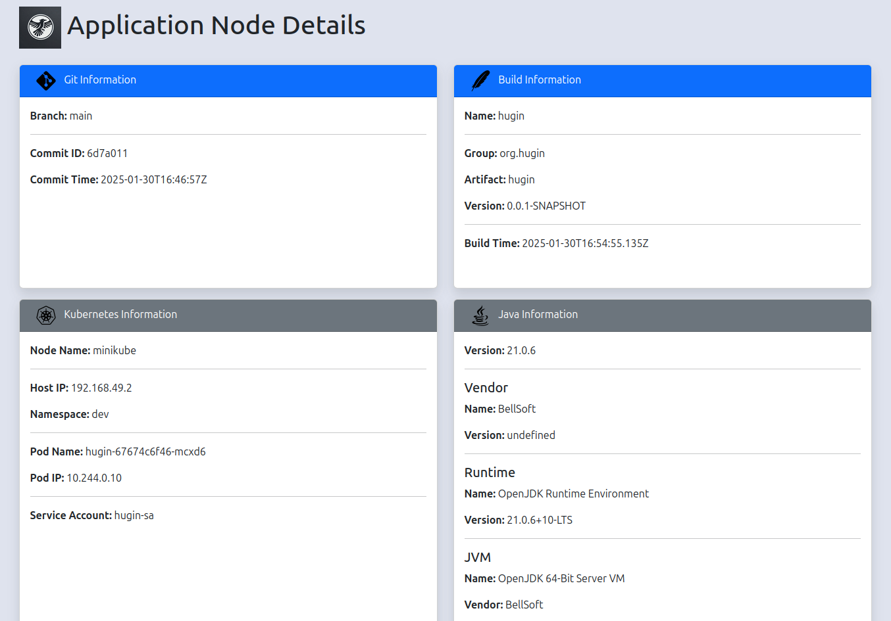

= Hugin

Simple demo application that show host and build info.

== Build

The project is a standard spring-boot maven project.

* fat jar : `./mvnw package`
* docker image: `./mvnw spring-boot:build-image`
* docker image with commit id in the image tag: `./mvnw spring-boot:build-image -Pstaging`

